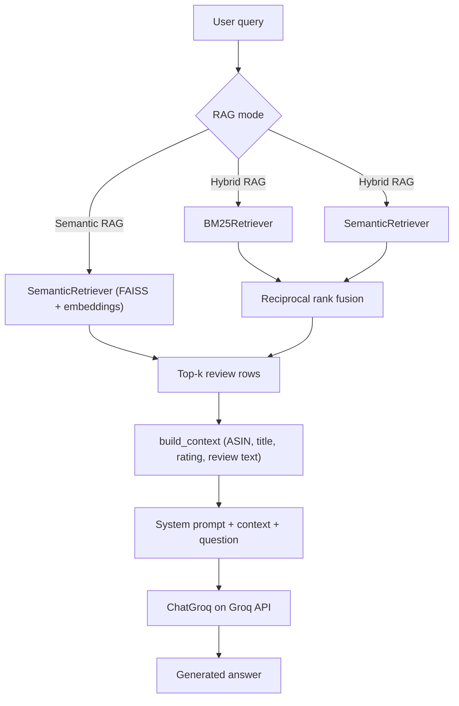

# DSCI 575 Project

This project implements retrieval over the **Video Games** category of [Amazon Reviews 2023](https://huggingface.co/datasets/McAuley-Lab/Amazon-Reviews-2023): **BM25** lexical search, **dense** retrieval (sentence embeddings + FAISS), and **hybrid** ranking via reciprocal rank fusion. It also adds **RAG** (**semantic** or **hybrid** retrieval + **Groq** LLM) over the same review-level corpus. A **Streamlit** application exposes search-only and RAG modes; **offline evaluation** outputs qualitative comparisons, hybrid RAG JSON runs, and precision/recall/MRR-style metrics against labeled queries.

**Release:** [v0.2.0](https://github.com/UBC-MDS/DSCI_575_project_li0606_Lukeni/releases/tag/v0.2.0) 
Data processing:
We use the Amazon Reviews 2023 Video_Games category. Each retrieval document is built at the review level and enriched with product metadata. The final retrieval text combines product title, categories, features, description, review title, and review text. Preprocessing includes lowercasing, removing most punctuation, normalizing whitespace, and using whitespace tokenization for BM25. For efficiency, this project uses a representative sample rather than the full category.

## Badges


## Repository structure

```
.
├── README.md
├── requirements.txt         # Python dependencies (single source of truth for pip)
├── environment.yml          # Conda: Python + PyTorch base, then `pip install -r requirements.txt`
├── Makefile                 # shortcuts: install, raw, eval, metrics, dev, clean (see `make help`)
├── .env.example             # example environment variables (optional; copy to .env)
├── .gitignore               # ignores secrets, raw data, and local processed artifacts (small eval CSVs may be tracked)
├── data/
│   ├── raw/                 # downloaded *.jsonl (ignored)
│   └── processed/           # generated indices and eval outputs (ignored except whitelisted CSVs)
├── notebooks/
│   ├── milestone1_exploration.ipynb  # EDA + preprocessing + sample indices (required for app/eval)
│   └── milestone2_rag.ipynb          # RAG exploration: Groq checks, semantic vs hybrid, prompts
├── docs/
│   └── RELEASE_NOTES_v0.2.0.md       # copy-paste body for GitHub Release v0.2.0
├── src/
│   ├── __init__.py          # marks `src` as a Python package
│   ├── bm25.py              # BM25 retriever
│   ├── semantic.py          # embedding + vector search
│   ├── retrieval_metrics.py # Precision@k, Recall@k, MRR
│   ├── retrieval.py         # index bundle discovery, load, RRF hybrid
│   ├── rag_pipeline.py      # semantic + hybrid RAG (Groq LLM)
│   ├── hybrid.py            # BM25 + dense hybrid retriever (RRF) for RAG
│   ├── evaluation.py        # offline eval: ``python -m src.evaluation {qualitative|metrics|milestone2_rag|eval|all}``
│   ├── milestone2_rag_eval.py   # hybrid RAG JSON → ``results/milestone2_rag_eval_runs.json``
│   └── utils.py             # corpus construction + tokenization utilities
├── results/
│   ├── milestone1_discussion.md   # qualitative retrieval evaluation notes
│   ├── milestone2_discussion.md   # RAG qualitative discussion / evaluation
│   └── milestone2_rag_eval_runs.json  # generated by ``make eval`` (requires ``GROQ_API_KEY``)
└── app/
    └── app.py               # Streamlit app (local)
```

## Setup

### 1) Create and activate a Python environment

The **conda** environment name is **`dsci575-ml`** (hyphen between `575` and `ml`, not an underscore).

#### Conda (recommended): `make install`

You only need a working **conda** (Miniconda or Anaconda) on your PATH. You **do not** need to create `dsci575-ml` beforehand, and you **do not** need to `conda activate` anything before running this.

From the repository root:

```bash
make install
```

This runs:

```bash
conda env update -f environment.yml --prune
```

That command **creates** the environment if it is missing, or **updates** it if it already exists; `--prune` removes packages that were dropped from `environment.yml`. Then install the pip stack from `requirements.txt` as specified in the YAML.

After it finishes, activate:

```bash
conda activate dsci575-ml
```

Equivalent without Make: run `conda env update -f environment.yml --prune` yourself, then `conda activate dsci575-ml`.

#### `venv` (no conda)

```bash
python -m venv .venv
source .venv/bin/activate   # Windows: .venv\Scripts\activate
pip install -r requirements.txt
```

### 2) Dependencies inside the conda env

`requirements.txt` is the canonical list of pip packages (used for `venv`, CI, Streamlit Cloud, and as the `-r` file for conda). The conda path uses `environment.yml` for a small conda base (Python 3.11, NumPy, PyTorch) and then installs pip dependencies via `make install` / `conda env update` as above. If you already use `venv` only, install with:

```bash
pip install -r requirements.txt
```

### 3) Environment variables

Copy `.env.example` to `.env` when you need overrides. Do not commit `.env`.

**Paths (retrieval app):** **`PROCESSED_DATA_DIR`** (default `data/processed/`) and **`FEEDBACK_LOG_PATH`** (default `data/processed/app_feedback.csv`).

**Groq API (RAG):** `src/rag_pipeline.py` reads **`GROQ_API_KEY`** and optional **`LLM_MODEL`** (see `.env.example`). Without `GROQ_API_KEY`, the **Search** tab still works; the **RAG** tab shows an error until the key is set.

**Shared key in `.env.example`:** For this student project, `.env.example` may include a **Groq free-tier API key** so the team and graders can run RAG without each registering a key. Treat that value as **public** (anyone with the repo can use or exhaust quota). For private forks, production, or sensitive data, create your own key at [Groq Console](https://console.groq.com/keys) and put it in `.env` only.

### 4) Dependency changes after `git pull`

If `requirements.txt` or `environment.yml` changed, refresh the conda env from the repo root (no need to activate first):

```bash
make install
```

Or manually: `conda env update -f environment.yml --prune`. If you use **venv** only: `pip install -r requirements.txt`.

---

## RAG pipeline

Natural-language answers use **only** retrieved Amazon review rows as context, generated by a hosted LLM. Each request picks **one** RAG mode; the diagram below is the single path the code implements (`src/rag_pipeline.py`, Streamlit **RAG** tab).



**Following the diagram:** **Semantic RAG** sends the query only through **SemanticRetriever** (sentence embeddings + FAISS) to obtain top-`k` rows. **Hybrid RAG** runs **BM25** and **SemanticRetriever** in parallel, merges ranked lists with **reciprocal rank fusion (RRF)**, then keeps top-`k`. Both modes produce the same kind of **review rows** (`DOCS`), which **build_context** turns into a text block (ASIN, title, rating, review text). That block is combined with a **system prompt** and the user question into a single prompt string, then **ChatGroq** calls the Groq API to produce the final answer. The **Search** tab uses the same retrievers but skips `build_context` and Groq: it shows ranked hits only (typically top 10).

| Step | Where in code | Role |
|------|---------------|------|
| Semantic retrieval only | `SemanticRAGPipeline` in `src/rag_pipeline.py` | Dense search → top-`k` → shared prompt path. |
| Hybrid retrieval | `HybridRAGPipeline` + `HybridRetriever` in `src/hybrid.py` | BM25 + dense → RRF → top-`k` → same prompt path as semantic-only. |
| Offline hybrid runs | `src/milestone2_rag_eval.py` | Fixed query set → `results/milestone2_rag_eval_runs.json` (see `results/milestone2_discussion.md`). |
| Notebook exploration | `notebooks/milestone2_rag.ipynb` | API checks, retrieval vs full RAG, prompt variants V1–V3, optional exports under `data/processed/`. |

**System prompts** `SYSTEM_PROMPT_V1`–`V3` are defined in `src/rag_pipeline.py`; the Streamlit **RAG** tab can use presets or a custom system string (same context + question wrapping as in code). **Optional `src/tools.py`:** not used; no agent tools are wired into RAG.

**Model and credentials:** RAG uses **Groq** via `langchain-groq` (`ChatGroq`). Set **`GROQ_API_KEY`** and optionally **`LLM_MODEL`** in `.env` (default model `llama-3.1-8b-instant` if unset). See *Environment variables* above.

## Download the raw dataset

This project uses the **Video_Games** category from the [Amazon Reviews 2023](https://huggingface.co/datasets/McAuley-Lab/Amazon-Reviews-2023) dataset. Two files are required: review records and product metadata.

From the repository root:

```bash
make raw
```

| File | Role |
|------|------|
| `data/raw/Video_Games.jsonl` | Reviews |
| `data/raw/meta_Video_Games.jsonl` | Product metadata |

Requires `curl`. Downloads can take several minutes.

## Run the Streamlit app locally

You need a **working app on your machine**; retrieval indices are **saved locally** (not required to be in Git).

1. **Install the environment** (sections *Setup* → 1–2 above).
2. **Download raw data** with `make raw` (needed for `milestone1_exploration.ipynb`).
3. **Build the sample index bundle** — open `notebooks/milestone1_exploration.ipynb` and run through at least:
   - representative **sample corpus** build and save,
   - **BM25** build and save,
   - **semantic (embeddings + FAISS)** build and save.  
   This writes the notebook sample bundle under `data/processed/`, including:
   - `video_games_corpus_sample.parquet` or `video_games_corpus_sample.csv`
   - `bm25_sample_index.pkl`, `bm25_sample_tokens.pkl`
   - `faiss_sample.index`, `semantic_sample_metadata.pkl`
4. **Configure `.env`** with `GROQ_API_KEY` (and optionally `LLM_MODEL`) if you want the **RAG** tab; see *Environment variables* above.
5. **Start the app** from the repo root:

```bash
conda activate dsci575-ml
make dev
```

The Makefile target `dev` checks that conda env **`dsci575-ml`** is active. If you use **venv** instead, run Streamlit directly (no `check-env`):

```bash
source .venv/bin/activate
pip install -r requirements.txt
streamlit run app/app.py
```

6. Open the URL shown in the terminal (default `http://127.0.0.1:8501`). If indices are missing, the app will error until step 3 completes successfully.

### App modes

| Tab | What it does | Requirements |
|-----|----------------|--------------|
| **Search** | BM25, Semantic, or **Hybrid** (RRF) over the sample index — **no LLM**. Top **10** hits. | Sample bundle in `data/processed/` |
| **RAG** | **Semantic RAG** (dense only) or **Hybrid RAG** (BM25 + dense → RRF). **Top 5** reviews feed the prompt. Preset **V1–V3** or custom system prompt. | Same bundle + **`GROQ_API_KEY`** |

How **Semantic RAG** vs **Hybrid RAG** connect to **build_context** and Groq is shown in the **RAG pipeline** section (workflow diagram above).

Optional: `make install` updates the conda environment **`dsci575-ml`** from `environment.yml` after dependency changes.

### RAG exploration notebook

Run `notebooks/milestone2_rag.ipynb` **after** the sample indices from `milestone1_exploration.ipynb` exist and `.env` is configured. It records **exploration** (Groq sanity check, semantic vs hybrid retrieval and RAG, prompt-variant comparison, optional exports to `data/processed/milestone2_*`). It is **not** required to launch the Streamlit app.

## Qualitative evaluation

With the sample retrieval bundle in `data/processed/`:

```bash
conda activate dsci575-ml
make eval
```

This runs **two** steps: (1) BM25 vs semantic comparison for every query in `data/processed/ground_truth.csv` → `data/processed/qualitative_eval_runs.csv`; (2) **hybrid RAG** on a fixed 10-query set → `results/milestone2_rag_eval_runs.json` (requires **`GROQ_API_KEY`** in `.env`). Discussion notes: `results/milestone1_discussion.md` (retrieval), `results/milestone2_discussion.md` (RAG).

To run only the qualitative CSV or only the RAG JSON:

```bash
PYTHONPATH=. python -m src.evaluation qualitative
PYTHONPATH=. python -m src.evaluation milestone2_rag
```

### Retrieval metrics

With `relevant_doc_ids` filled in `data/processed/ground_truth.csv` and the same sample artifacts as above:

```bash
conda activate dsci575-ml
make metrics
```

This writes `data/processed/retrieval_metrics_summary.csv` and `retrieval_metrics_per_query.csv`. See `results/milestone1_discussion.md` for interpretation.

Both steps use the same index bundle as the Streamlit app (`src/retrieval.discover_bundle()` loads the **notebook sample** bundle only). To run qualitative export and metrics in one command:

```bash
PYTHONPATH=. python -m src.evaluation all
```

## Makefile shortcuts

```bash
make help      # list targets
make install   # update conda env dsci575-ml from environment.yml
make raw       # download Video_Games JSONL files into data/raw/ (Hugging Face)
make eval      # qualitative CSV + hybrid RAG JSON (needs GROQ_API_KEY for JSON)
make metrics   # P@k, R@k, MRR from labeled ground_truth.csv
make dev       # local Streamlit dev server
make clean     # remove __pycache__, *.pyc, data/raw downloads, and data/processed/* (except .gitkeep)
```

`make clean` deletes local downloads and processed outputs. Regenerate indices by re-running the notebook (and `make raw` if needed).

## Reproducibility checklist

1. **Conda:** run **`make install`** (or `conda env update -f environment.yml --prune`), then `conda activate dsci575-ml`. **venv:** `python -m venv .venv` + `pip install -r requirements.txt`.
2. Run `make raw` to download `Video_Games.jsonl` and `meta_Video_Games.jsonl` under `data/raw/`.
3. Run `notebooks/milestone1_exploration.ipynb` through corpus + BM25 + semantic cells so `data/processed/` contains the **sample** bundle (see *Run the Streamlit app*).
4. Copy `.env.example` → `.env` and set **`GROQ_API_KEY`** (and optional **`LLM_MODEL`**) for RAG and `make eval`.
5. **App:** `conda activate dsci575-ml` → `make dev` (or `streamlit run app/app.py` from venv).
6. **Optional:** run `notebooks/milestone2_rag.ipynb` for RAG exploration outputs.
7. **Eval:** `make eval` → `data/processed/qualitative_eval_runs.csv` + `results/milestone2_rag_eval_runs.json`. Discussion: `results/milestone1_discussion.md`, `results/milestone2_discussion.md`.
