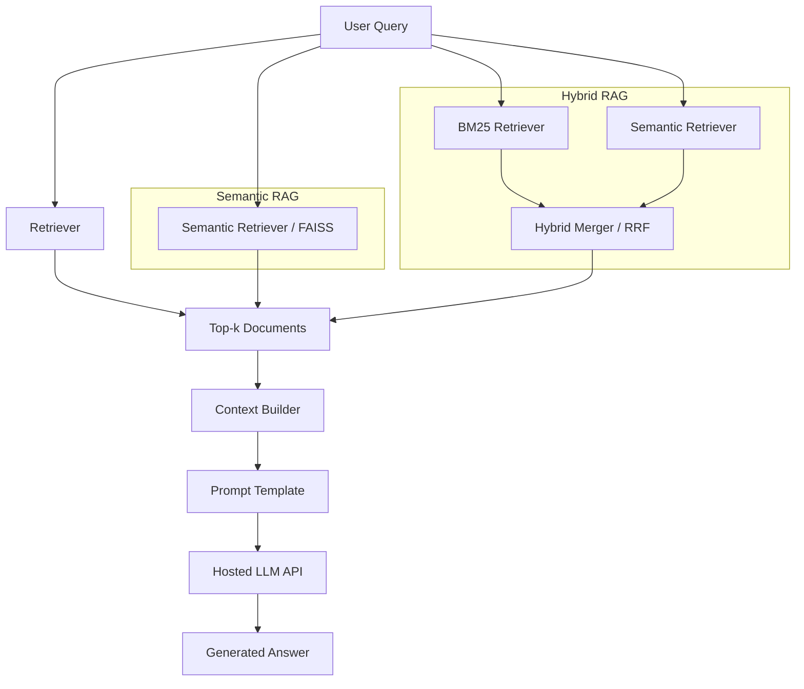

# DSCI 575 Project

This project implements retrieval over the **Video Games** category of [Amazon Reviews 2023](https://huggingface.co/datasets/McAuley-Lab/Amazon-Reviews-2023): **BM25** lexical search, **dense** retrieval (sentence embeddings + FAISS), and **hybrid** ranking via reciprocal rank fusion. A **Streamlit** application provides interactive search and optional relevance feedback; **offline evaluation** scripts output qualitative comparisons and precision/recall/MRR-style metrics against labeled queries.

Data processing:
We use the Amazon Reviews 2023 Video_Games category. Each retrieval document is built at the review level and enriched with product metadata. The final retrieval text combines product title, categories, features, description, review title, and review text. Preprocessing includes lowercasing, removing most punctuation, normalizing whitespace, and using whitespace tokenization for BM25. For efficiency, this project uses a representative sample rather than the full category.

## Badges


## Repository structure

```
.
├── README.md
├── requirements.txt         # Python dependencies (single source of truth for pip)
├── environment.yml          # Conda: Python + PyTorch base, then `pip install -r requirements.txt`
├── Makefile                 # shortcuts: install, raw, eval, metrics, dev, clean (see `make help`)
├── .env.example             # example environment variables (optional; copy to .env)
├── .gitignore               # ignores secrets, raw data, and local processed artifacts (small eval CSVs may be tracked)
├── data/
│   ├── raw/                 # downloaded *.jsonl (ignored)
│   └── processed/           # generated indices and eval outputs (ignored except whitelisted CSVs)
├── notebooks/
│   └── milestone1_exploration.ipynb  # EDA + preprocessing + sample indices
├── src/
│   ├── __init__.py          # marks `src` as a Python package
│   ├── bm25.py              # BM25 retriever
│   ├── semantic.py          # embedding + vector search
│   ├── retrieval_metrics.py # Precision@k, Recall@k, MRR
│   ├── retrieval.py         # index bundle discovery, load, RRF hybrid
│   ├── rag_pipeline.py      # Milestone 2: semantic + hybrid RAG (Groq LLM)
│   ├── hybrid.py            # BM25 + dense hybrid retriever (RRF) for RAG
│   ├── evaluation.py        # offline eval: ``python -m src.evaluation {qualitative|metrics|all}``
│   └── utils.py             # corpus construction + tokenization utilities
├── results/
│   ├── milestone1_discussion.md   # Milestone 1 qualitative evaluation notes
│   └── milestone2_discussion.md   # Milestone 2 RAG discussion / evaluation (as required)
└── app/
    └── app.py               # Streamlit app (local)
```

## Setup

### 1) Create and activate a Python environment

The **conda** environment name is **`dsci575-ml`** (hyphen between `575` and `ml`, not an underscore).

Using `venv`:

```bash
python -m venv .venv
source .venv/bin/activate
```

Using `conda`:

```bash
conda env create -f environment.yml
conda activate dsci575-ml
```

### 2) Install dependencies

`requirements.txt` is the canonical list of pip packages (used for `venv`, CI, Streamlit Cloud, and as the `-r` file for conda). If you used `conda`, `environment.yml` installs a small conda base (Python 3.11, NumPy, PyTorch) and then runs `pip install -r requirements.txt`. If you used `venv`, install with:

```bash
pip install -r requirements.txt
```

### 3) Environment variables (optional)

Copy `.env.example` to `.env` when you need overrides. Do not commit `.env`.

**Paths (retrieval app):** **`PROCESSED_DATA_DIR`** (default `data/processed/`) and **`FEEDBACK_LOG_PATH`** (default `data/processed/app_feedback.csv`).

**Groq API (Milestone 2 RAG):** `src/rag_pipeline.py` reads **`GROQ_API_KEY`** and optional **`LLM_MODEL`** (see `.env.example`).

**Shared key in `.env.example`:** For this student project, `.env.example` commits a **Groq free-tier API key** so the team and graders can run RAG without each registering a key. Treat that value as **public** (anyone with the repo can use or exhaust quota). For private forks, production, or sensitive data, create your own key at [Groq Console](https://console.groq.com/keys) and put it in `.env` only.

## Milestone 2 LLM setup

RAG uses **Groq** via `langchain-groq` (`ChatGroq`). After installing dependencies, copy `.env.example` to `.env` if you need overrides; the committed example already includes a shared key (see disclosure above).

- **`LLM_MODEL`:** defaults to `llama-3.1-8b-instant` if unset.
- **Implementation:** `SemanticRAGPipeline` and `HybridRAGPipeline` live in `src/rag_pipeline.py`; hybrid retrieval merges BM25 and dense results in `src/hybrid.py`.

## Download the raw dataset

This project uses the **Video_Games** category from the [Amazon Reviews 2023](https://huggingface.co/datasets/McAuley-Lab/Amazon-Reviews-2023) dataset. Two files are required: review records and product metadata.

From the repository root:

```bash
make raw
```

| File | Role |
|------|------|
| `data/raw/Video_Games.jsonl` | Reviews |
| `data/raw/meta_Video_Games.jsonl` | Product metadata |

Requires `curl`. Downloads can take several minutes.

## Run the Streamlit app locally

The milestone expects a **working app on your machine**; retrieval indices are **saved locally** (not required to be in Git).

1. **Install the environment** (sections *Setup* → 1–2 above).
2. **Download raw data** with `make raw` (needed for the exploration notebook).
3. **Open** `notebooks/milestone1_exploration.ipynb` and run through at least:
   - representative **sample corpus** build and save,
   - **BM25** build and save,
   - **semantic (embeddings + FAISS)** build and save.  
   This writes the notebook sample bundle under `data/processed/`, including:
   - `video_games_corpus_sample.parquet` or `video_games_corpus_sample.csv`
   - `bm25_sample_index.pkl`, `bm25_sample_tokens.pkl`
   - `faiss_sample.index`, `semantic_sample_metadata.pkl`
4. **Start the app** from the repo root (with `dsci575-ml` activated if using conda):

```bash
make dev
```

or:

```bash
streamlit run app/app.py
```

5. Open the URL shown in the terminal (default `http://127.0.0.1:8501`). If indices are missing, the app will error until step 3 completes successfully.

Optional: `make install` updates the conda environment **`dsci575-ml`** from `environment.yml` after dependency changes.

## Qualitative evaluation

With the sample retrieval bundle in `data/processed/`, regenerate BM25 vs semantic comparison rows for all queries in `data/processed/ground_truth.csv`:

```bash
conda activate dsci575-ml
make eval
```

This writes `data/processed/qualitative_eval_runs.csv`. Discussion notes belong in `results/milestone1_discussion.md`.

### Retrieval metrics

With `relevant_doc_ids` filled in `data/processed/ground_truth.csv` and the same sample artifacts as above:

```bash
conda activate dsci575-ml
make metrics
```

This writes `data/processed/retrieval_metrics_summary.csv` and `retrieval_metrics_per_query.csv`. See `results/milestone1_discussion.md` for interpretation.

Both steps use the same index bundle as the Streamlit app (`src/retrieval.discover_bundle()` loads the **notebook sample** bundle only). To run qualitative export and metrics in one command:

```bash
PYTHONPATH=. python -m src.evaluation all
```

## Makefile shortcuts

```bash
make help      # list targets
make install   # update conda env dsci575-ml from environment.yml
make raw       # download Video_Games JSONL files into data/raw/ (Hugging Face)
make eval      # BM25 vs semantic comparison (ground_truth.csv → qualitative_eval_runs.csv)
make metrics   # P@k, R@k, MRR from labeled ground_truth.csv
make dev       # local Streamlit dev server
make clean     # remove __pycache__, *.pyc, data/raw downloads, and data/processed/* (except .gitkeep)
```

`make clean` deletes local downloads and processed outputs. Regenerate indices by re-running the notebook (and `make raw` if needed).

## Reproducibility checklist

- Create the environment from `environment.yml` (conda env **`dsci575-ml`**) or from `requirements.txt` in a `venv`.
- Run `make raw`, then execute the sample corpus, BM25, and semantic sections of `notebooks/milestone1_exploration.ipynb` so `data/processed/` contains the app bundle.
- Activate **`dsci575-ml`** if using conda, then run `make dev` to launch the Streamlit app locally.

## Workflow diagram



